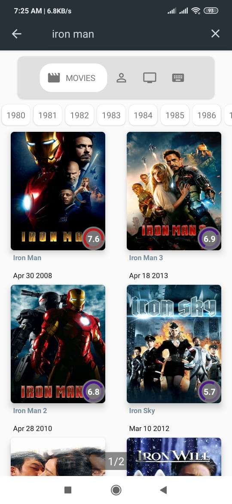
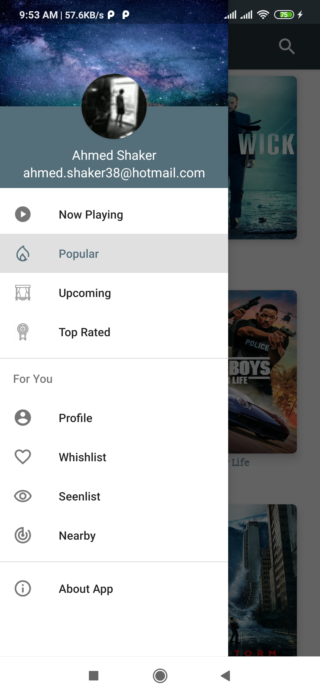
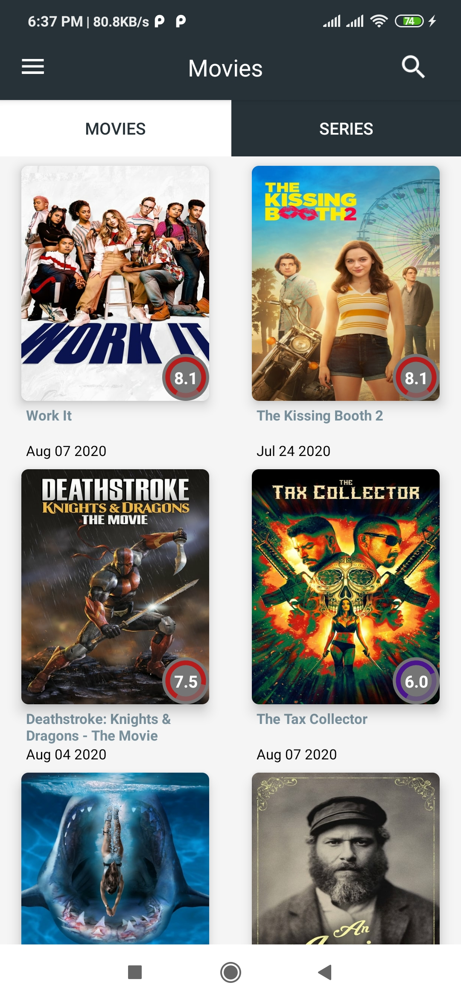
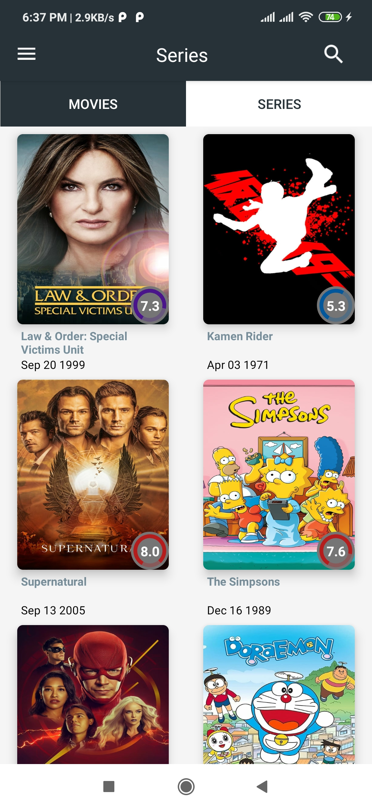
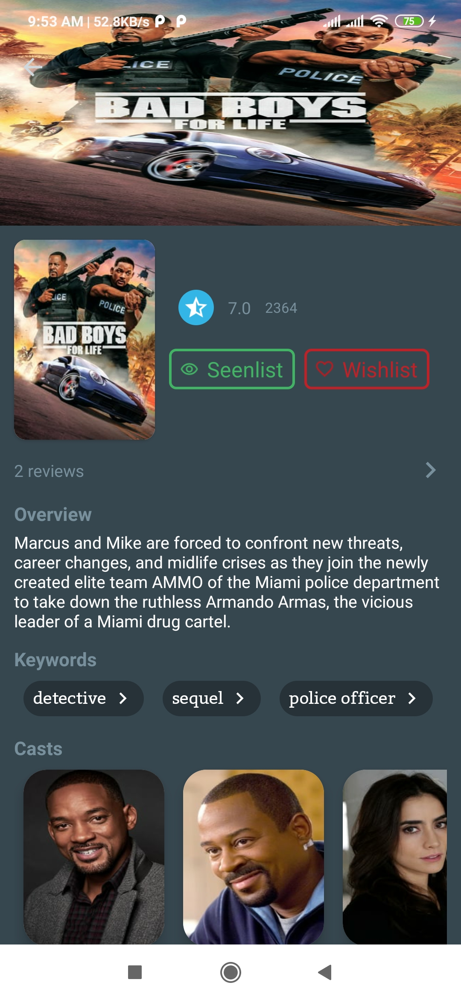
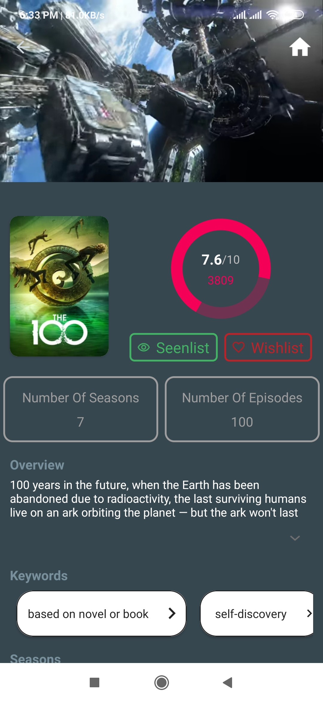
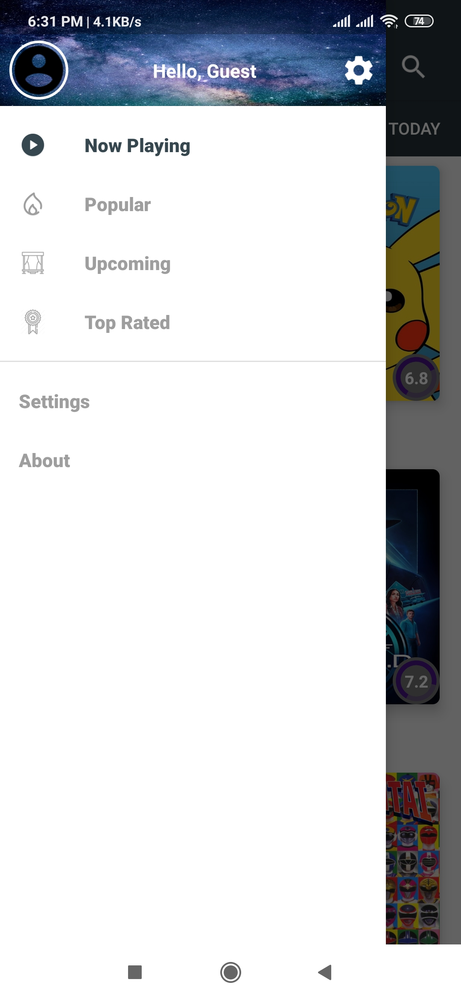
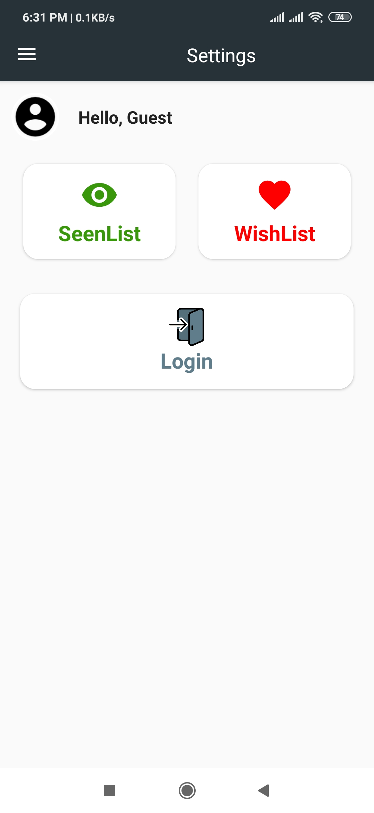
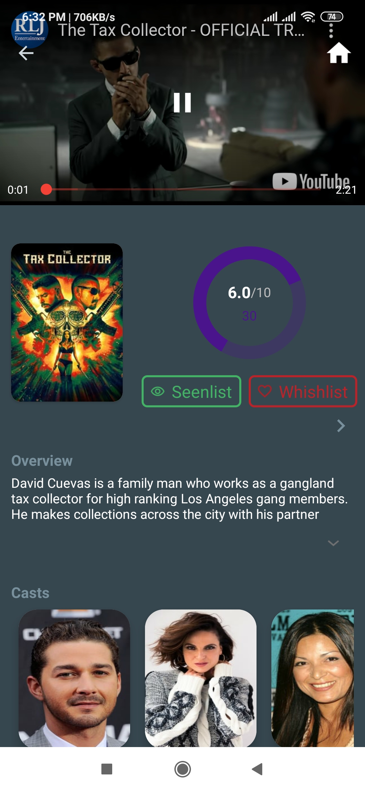

# MovieDB

### Features:-
    1- Mvp.
    2- Rxjava,
    3- RoomDB,
    4- MovieDb Api.
    5- Firebase email and password auth.
    6- Google and Facebook auth.
    7- Fragments.
    8- Youtube library for movies trailers.
    9- Expandable textview.
    
### Download apk version:-
    https://www.mediafire.com/file/84yv8ulqsfg18vz/file

     

    

    

    

 